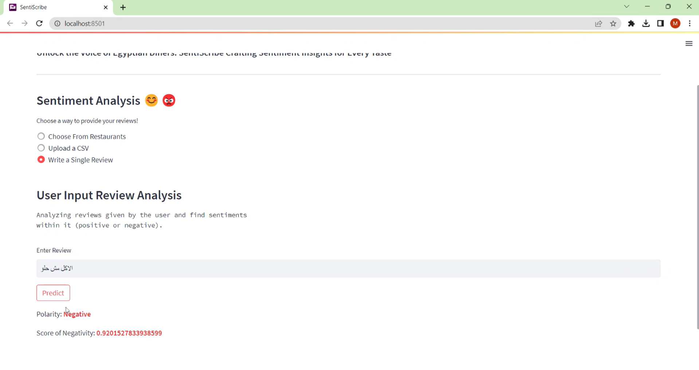
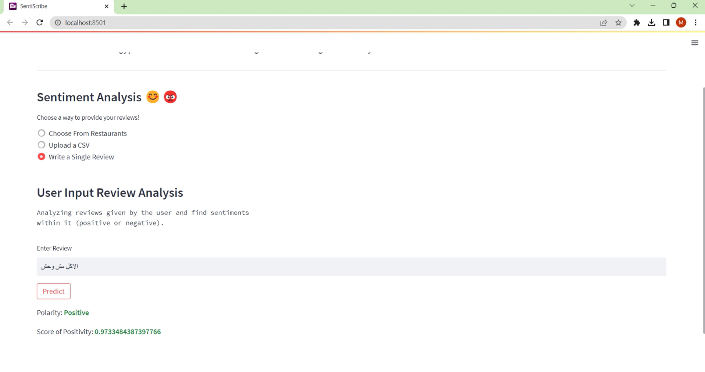
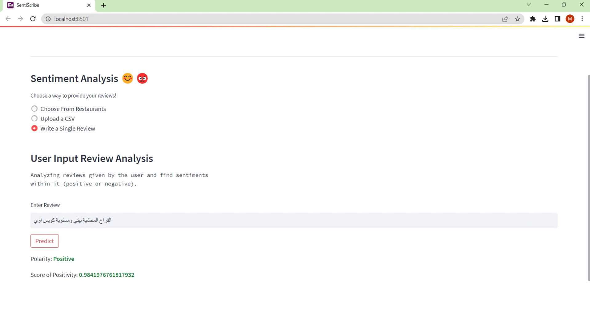
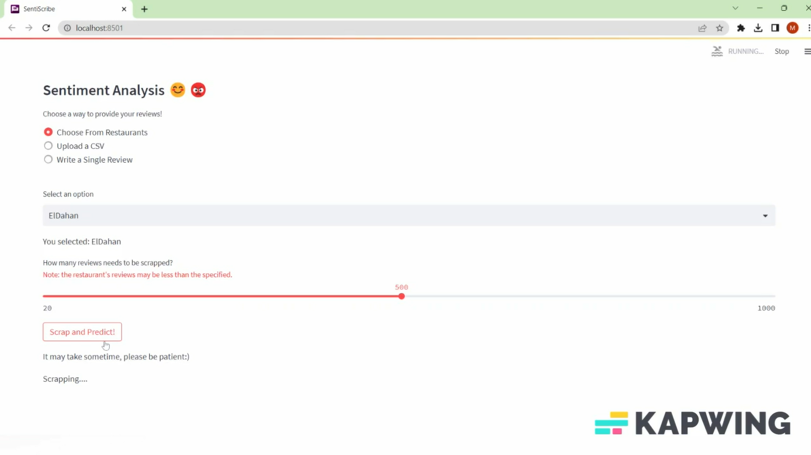
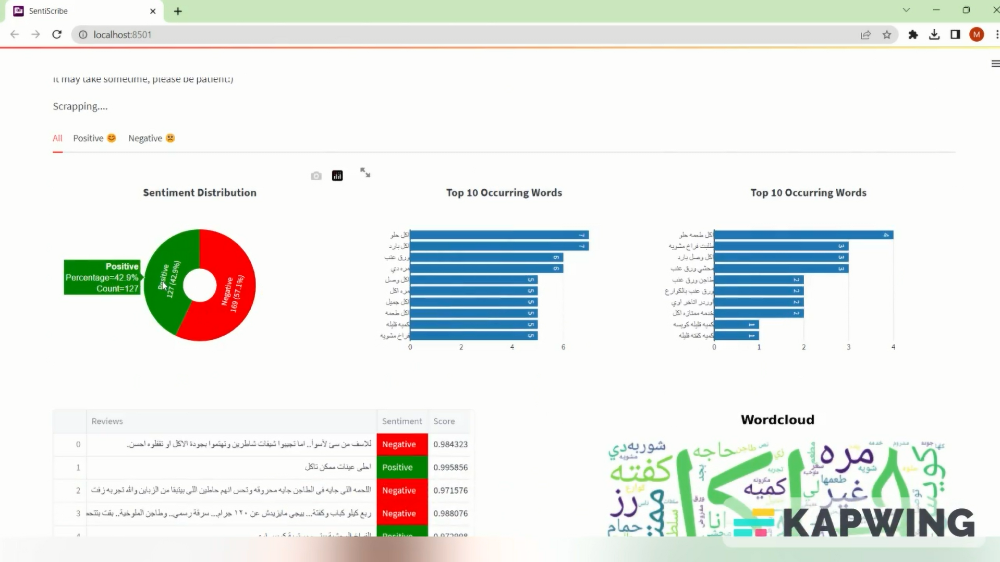
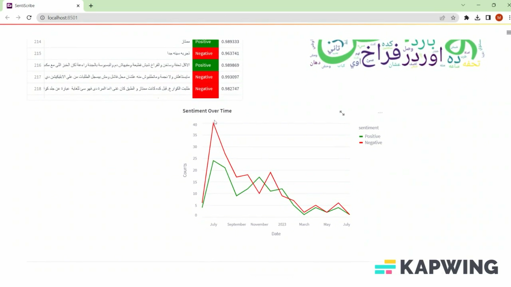

# SentiScripe
* A web interface (Sentiment Analysis Tool) for **Egyptian Restaurant's Reviews**.
* Built to help restaurant owners know the quality of service they provide through Exploaratory Data Analysis (EDA) over customer reviews.
* Also, it will help customers to know the restaurant offerings quality with most recent reviews.
* Food ordering platform can use our analysis to recommend the best restaurants to their customers.

## What is Sentiment Analysis?
* Sentiment analysis is a field of study in Natural Language Processing (NLP) that aims to determine the sentiment expressed in a text.
*  In the context of Arabic Language and dialects, sentiment analysis of restaurant reviews can provide valuable insights into the opinions of customers regarding their eating experiences.

## Functional Requirements
* User enter single review in Egyptian dialect.
* User uploads a CSV file containing reviews.
* User chooses a restaurant to scrap its recent reviews.
* System then predict reviews and visualizes in a dashboard showing the EDA.

## Software Tools
* Google Colab for training models.
* Huggingface for tranformers library.
* Streamlit for creating web interface.
* Trello for organizing and dividing tasks.
* Github for collaborating
* Pycharm & VS Code For developing

## System Analysis
### DataSet
* We have collected dataset contains 137K of Egyptian dialect restaurant reviews form Talabat and El-Menus. They are divided into 69k from Talabat and the rest from Elmenus.
* we scarped from El-Menus and Talabat, and convert from ratings to polarities: the ratings of 4, 5 to be polarity 1 (positive), 1 and 2 to be -1 (negative), and 3 to be 0 (neutral).
* we dropped the neutral class from our dataset to make it balanced to make models train better and get higher accuracy.

### Preprocessing
* English letters and special character removal.
* Stop words removal.
* Stemming.
* Normalization.

## Experiments & Results
### Transformers 
* AraBERT with 90% (which the higher accuracy among all models and the **Used Model in our Tool**)
* CamelBERT with 89.5%

### Ml models with normalization
* SVM comes at the top of higher accuracy with 87.3%
 

### DL models
* CNN with accuracy 87.49%
* LSTM with 88%

## DEMO

  
  
  
  
  
  

 

